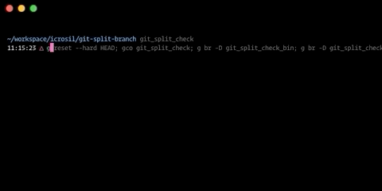

# git-split-branch
Ever wanted to split big branch by directories changed? Stop giving your teammates big PRs if you can split it.

## Installation

Next commands will add `git-split-branch` binary to your binary list.

### Yarn

`yarn global add git-split-branch`

### NPM

`npm install -g git-split-branch`

## Usage

`git-split-branch dir`

This command will help you split your current branch into new extra branch with changes only in folder dir.

### Arguments

#### dir [otherDirs...]

Directories you want to split branch to.
You could specify exact branches or part of directory name.

- `dir/full/path`
- `path`

### Options

#### -V, --version

Output current `git-split-branch` version.

#### -w, --workdir

Directory where actual split will happen.

"./" by default.

#### -R, --no-root

Flag if cli should run all commands from root of repo or not. With `-R` flag all commands will go from `-w` directory otherwise from root of repo.

"false" by default.

#### -f, --from

Branch you'd like to compare from. Used to find diff commits. Specify `-f BRANCH` if you want compare to custom branch.

"develop" by default.

#### -t, --to

Branch you'd like to compare to. Used to find diff commits. Specify `-t BRANCH` if you want compare to custom branch.

"CURRENT BRANCH" by default.

#### -b, --branches

Branches you would like to commit to, separated by ";".
Count of branches should be same as directories to use for split.

By default CLI will propose you to create branches based on `-t` option.

#### -v, --verbosity

Set logger level to log extra information just in case.
`-v` would make 'info' verbosity.
`-v debug` would specify exact level of verbosity.
No extra levels supported.

"notice" level by default.

#### -d, --find-depth

Depth of looking for directories when finding best match for input.

"5" by default.

#### -h, --help

Log some help.

## Algo underneath

- find directories with fuzzySearch
- create branches for each split
- find all commits effected each directory separately with `git rev-list --reverse --no-merges FROM..TO -- DIR`
- apply all commits one by one for each dir `git checkout HASH -- DIR`
